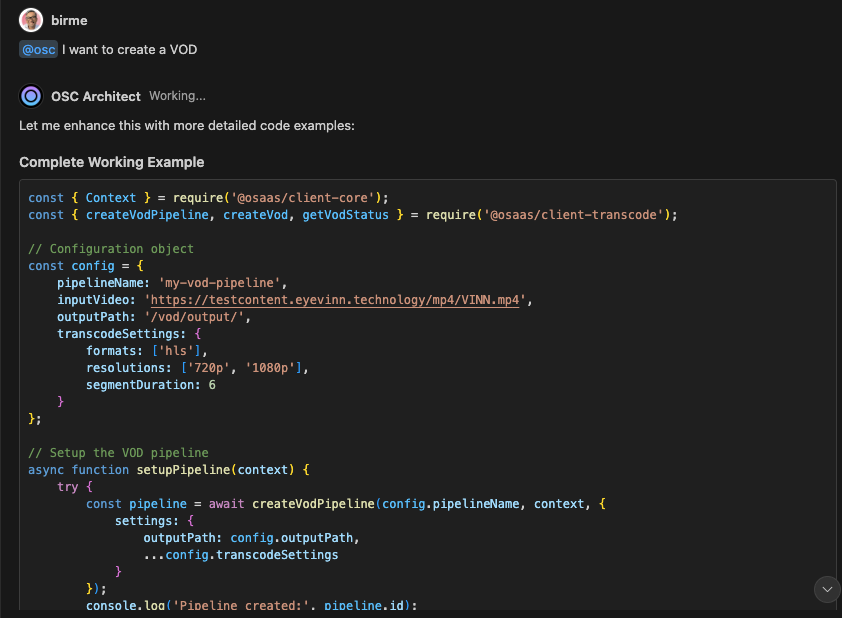

# OSC Architect Chat Extension

Introducing a Copilot chat participant called `@osc` that helps you building solutions based on Open Web Services in Eyevinn Open Source Cloud.

## Prerequisites

- An [Eyevinn Open Source Cloud account](https://www.osaas.io)

## Configuration

Navigate to the [Web Console](https://app.osaas.io) and register with your email. Signup is free and on the free plan you have access to create one open web service at the time. Upgrade to startup or business plan gives you access to use more open web services at the same time. Create a tenant and you are good to go.

You can now obtain the access token by navigating to Settings / API in the web console. Copy this and add it to the `osc-access-token` configuration in the Eyevinn Open Source Cloud extension settings.
s